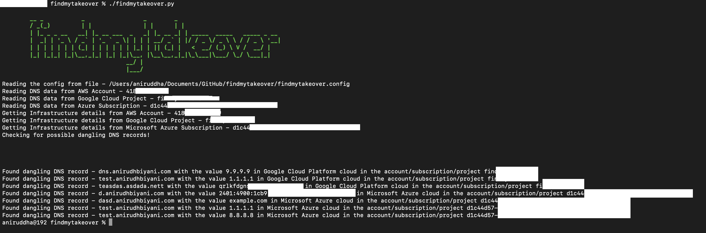

# findmytakeover

findmytakeover detects dangling DNS record in a multi cloud environment. It does this by scanning all the DNS zones and the infrastructure present within the configured cloud service provider either in a single account or multiple accounts and finding the DNS record for which the infrastructure behind it does not exist anymore rather than using wordlist. It can easily detect and report potential subdomain takeovers that exist. 

This tool is not tested to run on non commercial Cloud Service Provider regions like AWS GovCloud, Azure Government or Google for Government but should be able to run without any issues. 



## Why?
They are a threat because they allow attackers to host infrastructure behind your domain which can be used for any sort of puropose and getting the entire traffic to an attacker-controlled domain with complete access to the domain’s content and resources.

This can become a breeding ground for malicious resources manipulated by an attacker that the domain owner has no control over. This means that the attacker can completely exercise dominance over the domain name to run an illegal service, launch phishing campaigns on unsuspecting victims and malign your organization’s good name in the market. 
 
## Installation

There are depencies that are required to be installed based on the cloud provider that have been configured. 
```
git clone https://github.com/anirudhbiyani/findmytakeover.git
cd findmytakeover/
pip3 install -r requirement.txt
```

## Dependencies
Depending on the cloud provider, you would need permission read data. The following role would work for various cloud provider - 
  - Amazon Web Services - ViewOnlyRole
  - Microsoft Azure - Reader
  - Google Cloud - Viewer

## Usage
```
# ./findmytakeover.py --help
usage: findmytakeover.py [-h] [-c CONFIG_FILE]

optional arguments:
  -h, --help            show this help message and exit
  -c CONFIG_FILE, --config-file CONFIG_FILE
                        Enter the path to the configuration file that you want the tool to use.
```
The default value of the configuiration file would be the same directory where the tool is located and the configuration file would look like this.


Thee configuration file looks like this. 
```
dns:
  aws:
    enabled: false/true
    accounts:
      - 123456789012
      - 098765432109
      - 123123123123
    credentials: <Name of IAM Role that would be assumed>

  gcp:
    enabled: true/false
    credentials: <path to the service account's credentials file>
    accounts: 
      - project0
      - project1
      - project2

  azure:
    enabled: false/true
    credentials: <Service Account Key>
    accounts:
      - subscription1
      - subscription2
      - subscription3

infra:
  aws:
    enabled: false/true
    accounts:
      - 123456789012
      - 098765432109
      - 123123123123
    credentials: <Name of IAM Role that would be assumed>

  gcp:
    enabled: true/false
    credentials: <path to the service account's credentials file>
    accounts: 
      - project0
      - project1
      - project2

  azure:
    enabled: false/true
    credentials: <Service Account Key>
    accounts:
      - subscription1
      - subscription2
      - subscription3
```

## Limtitations 
This tools cannot guarantee 100% protection against subdomain takeovers. This will not protect you from dangling NS designations at the moment.

## Contributing

You can contribute to the project in many ways either by reporting bugs, writting documentation, or adding code.

Contributions are welcome! If you would like to contribute, please follow these steps:
  - Fork the repository.
  - Create a new branch:
    `$ git checkout -b feature/your-feature-name`
  - Make your changes and commit them:
    `$ git commit -m "Add your feature description"`
  - Push your changes to the forked repository:
    `$ git push origin feature/your-feature-name`
  - Open a pull request to the main repository.

have any questions? hit it me on GitHub or Email.
