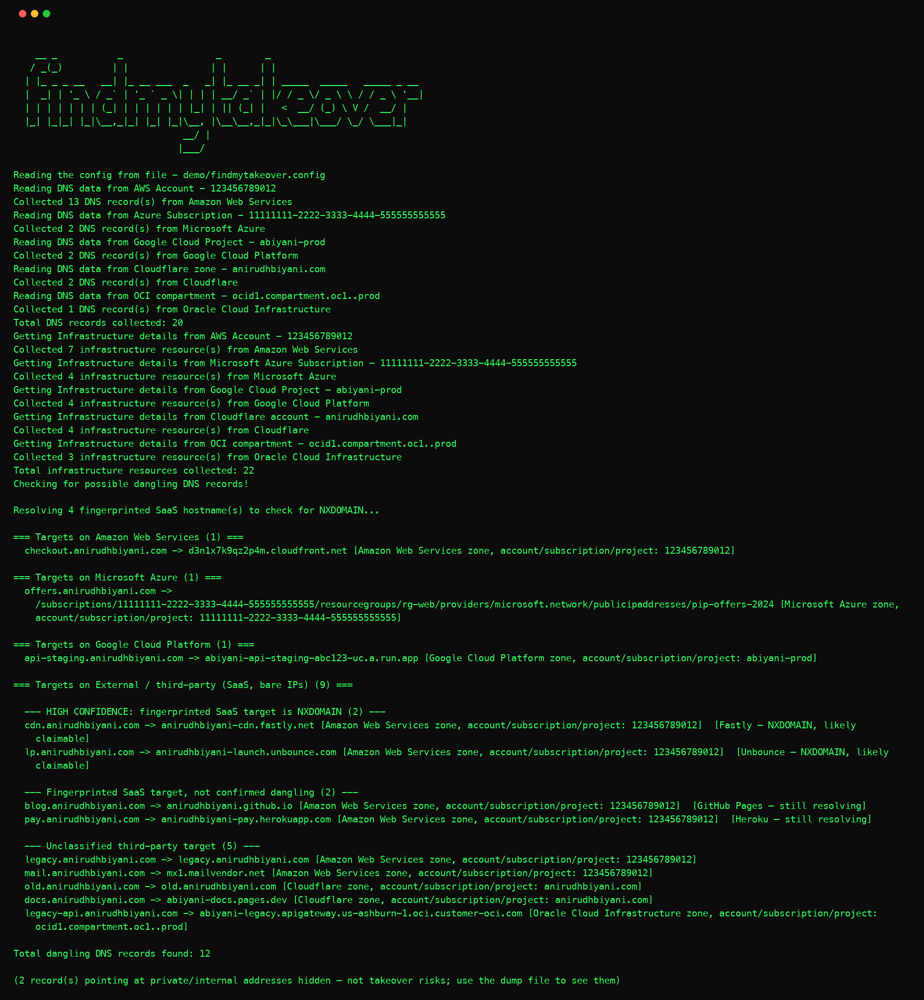

# findmytakeover

findmytakeover detects dangling DNS record in a multi cloud environment. It does this by scanning all the DNS zones and the infrastructure present within the configured cloud service provider either in a single account or multiple accounts and finding the DNS record for which the infrastructure behind it does not exist anymore rather than using wordlist. It can easily detect and report potential subdomain takeovers that exist. 

This tool is not tested to run on non commercial Cloud Service Provider regions like AWS GovCloud, Azure Government or Google for Government but should be able to run without any issues. 



## Why?
They are a threat because they allow attackers to host infrastructure behind your domain which can be used for any sort of puropose and getting the entire traffic to an attacker-controlled domain with complete access to the domain’s content and resources.

This can become a breeding ground for malicious resources manipulated by an attacker that the domain owner has no control over. This means that the attacker can completely exercise dominance over the domain name to run an illegal service, launch phishing campaigns on unsuspecting victims and malign your organization’s good name in the market. 
 
## Installation

### From PyPI
```
pip install findmytakeover
findmytakeover --help
```

### With Docker
The image is distroless, so config and cloud credentials are supplied at run
time via volume mounts:
```
docker build -t findmytakeover .
docker run --rm \
  -v "$PWD/findmytakeover.config:/app/findmytakeover.config" \
  -v "$HOME/.aws:/home/nonroot/.aws:ro" \
  findmytakeover
```

### From source
```
git clone https://github.com/anirudhbiyani/findmytakeover.git
cd findmytakeover/
pip3 install .
```

## Dependencies
Depending on the cloud provider, you would need permission read data. The following role would work for various cloud provider - 
  - Amazon Web Services - ViewOnlyRole and SecurityAudit
  - Microsoft Azure - Reader
  - Google Cloud - Viewer
  - Cloudflare - API token with Zone:Read, DNS:Read, Account:Read, Pages:Read
  - Oracle Cloud (OCI) - a group with `inspect`/`read` on dns, instances, load-balancers, and object-storage

## Usage
```
# findmytakeover --help
usage: findmytakeover [-h] [-c CONFIG_FILE] [-d DUMP_FILE]
                      [--verify-dns | --no-verify-dns] [--json JSON_FILE]
                      [--fail-on-findings] [--version]

Find dangling DNS records that may be vulnerable to subdomain takeover

options:
  -h, --help            show this help message and exit
  -c, --config-file CONFIG_FILE
                        Path to the configuration file
  -d, --dump-file DUMP_FILE
                        Path to save DNS and Infrastructure data
  --verify-dns, --no-verify-dns
                        Resolve third-party SaaS targets that match a known
                        takeover fingerprint to confirm NXDOMAIN dangling
                        records (requires the dnspython package). Use --no-
                        verify-dns to disable network lookups entirely.
  --json JSON_FILE      Write findings as JSON to this path, for feeding a
                        SIEM, ticketing system or dashboard. Use '-' for
                        stdout.
  --fail-on-findings    Exit with status 1 when dangling records are found, so
                        a CI job or scheduled scan fails instead of passing
                        silently. Off by default so existing scripts keep
                        their exit codes.
  --version             show program's version number and exit
```

### Third-party SaaS takeover detection

Beyond diffing DNS against cloud inventory, records pointing at a known
takeover-prone SaaS provider (GitHub Pages, Heroku, Shopify, Netlify, Fastly,
Zendesk and others) are fingerprinted, and the target hostname is resolved to
confirm the finding. **NXDOMAIN means the hostname is gone and likely
claimable** — those are reported as high confidence. A hostname that still
resolves, or a lookup that times out, is never treated as a confirmed finding.

This check is DNS-only — no HTTP requests are made. Disable network lookups
entirely with `--no-verify-dns`.

**What NXDOMAIN can and can't tell you.** Many SaaS providers wildcard their DNS,
so every hostname under them resolves whether or not the resource exists. Of the
suffixes in the fingerprint table, only `fastly.net`, `unbounce.com`,
`unbounceapp.com`, `helpscout.net`, `wistia.net` and `desk.com` return NXDOMAIN
for a name that doesn't exist. The rest — including `github.io`,
`herokuapp.com`, `myshopify.com`, `netlify.app` and `zendesk.com` — wildcard, so
a deleted resource still resolves.

Those are still reported, as "fingerprinted, not confirmed dangling". They just
can't be *confirmed* from DNS alone; settling them needs an HTTP fingerprint,
which this tool deliberately doesn't do. Treat the unconfirmed tier as a
worklist, not as noise.

### Using it in CI

```
findmytakeover --json findings.json --fail-on-findings
```

`--fail-on-findings` makes the exit status 1 when anything is found, so a
pipeline fails instead of passing silently. The JSON report carries a summary
plus a `confidence` field per finding, so alerting can key on
`confidence == "high"`.

### Output

The console report groups findings by the cloud that owns the target, and splits
third-party targets into three tiers: confirmed NXDOMAIN (high confidence),
fingerprinted but unconfirmed, and unclassified. Records pointing at private or
internal addresses are filtered out and reported only as a count.

`--json` writes the same findings in a machine-readable form:

```json
{
  "tool": "findmytakeover",
  "version": "2.0.0",
  "summary": {
    "total": 12,
    "high_confidence": 2,
    "hidden_internal": 2,
    "by_target_owner": { "Amazon Web Services": 1, "External": 9 }
  },
  "findings": [
    {
      "record": "cdn.example.com",
      "target": "example-cdn.fastly.net",
      "dns_provider": "Amazon Web Services",
      "account": "123456789012",
      "target_owner": "External",
      "saas_service": "Fastly",
      "dns_status": "nxdomain",
      "confidence": "high"
    }
  ]
}
```

`confidence` is one of `high` (fingerprinted SaaS target confirmed NXDOMAIN),
`inventory-miss` (a cloud resource that no longer exists),
`fingerprinted-still-resolving`, `fingerprinted-dns-unknown`,
`fingerprinted-unverified`, or `unclassified-third-party`.

## Configuration

The default configuration file is `findmytakeover.config` in the current
directory; override it with `-c`.

### Credentials

Each provider takes either explicit credentials or `credentials: default`, which
uses the session your local cloud CLI already has:

| Provider | `credentials: default` uses | Explicit alternative |
|---|---|---|
| AWS | the boto3 chain (`aws configure`, `aws sso login`, environment) | name of an IAM role to assume per account |
| Azure | `DefaultAzureCredential` (`az login`) | service principal (`AZURE_TENANT_ID`, `AZURE_CLIENT_ID`, `AZURE_CLIENT_SECRET`) |
| GCP | Application Default Credentials (`gcloud auth application-default login`) | path to a service-account key file |
| Cloudflare | `CLOUDFLARE_API_TOKEN` from the environment | the API token itself |
| Oracle | `~/.oci/config` | path to an OCI config file |

With `credentials: default` the `accounts` list becomes optional — AWS profiles,
Azure subscriptions, GCP projects, Cloudflare accounts and OCI compartments are
discovered automatically. Supply `accounts` to narrow the scan.

### Tuning

Collection is parallelised across accounts, regions, projects and compartments.
Set `FINDMYTAKEOVER_MAX_WORKERS` (default `8`) to lower concurrency if you hit
API rate limits.

### Example

```
exclude:
  ipaddress:
    - 100.1.0.0/16
  domains:
    - google.com 
    - example.com
    
dns:
  aws:
    enabled: false/true
    accounts:
      - 123456789012
      - 098765432109
      - 123123123123
    credentials: <Name of IAM Role that would be assumed>

  gcp:
    enabled: true/false
    credentials: <path to the service account's credentials file>
    accounts: 
      - project0
      - project1
      - project2

  azure:
    enabled: false/true
    credentials: <Service Account Key>
    accounts:
      - subscription1
      - subscription2
      - subscription3

  cloudflare:
    enabled: false/true
    credentials: default        # or the API token itself
    accounts:                   # optional: zone names to scope the scan
      - example.com

  oracle:
    enabled: false/true
    credentials: default        # or a path to an OCI config file
    accounts:                   # optional: compartment OCIDs
      - ocid1.compartment.oc1..example

infra:
  aws:
    enabled: false/true
    accounts:
      - 123456789012
      - 098765432109
      - 123123123123
    credentials: <Name of IAM Role that would be assumed>

  gcp:
    enabled: true/false
    credentials: <path to the service account's credentials file>
    accounts: 
      - project0
      - project1
      - project2

  azure:
    enabled: false/true
    credentials: <Service Account Key>
    accounts:
      - subscription1
      - subscription2
      - subscription3

  cloudflare:
    enabled: false/true
    credentials: default
    accounts:
      - example.com

  oracle:
    enabled: false/true
    credentials: default
    accounts:
      - ocid1.compartment.oc1..example
```

## Trying it without cloud credentials

`demo/` runs the tool end to end against a fixture inventory with no network
access at all — useful for seeing the output, or for demos:

```
python3 demo/demo.py
```

Only the cloud collectors and the DNS resolver are replaced; the diff engine,
fingerprinting, grouping and reports are the real code path. See
[demo/README.md](demo/README.md).

## Claude skill
A [Claude Code](https://docs.claude.com/en/docs/claude-code) skill is bundled under [`skills/dangling-dns-finder`](skills/dangling-dns-finder). It lets you run a dangling-DNS / subdomain-takeover audit conversationally ("find dangling domains across my AWS and GCP accounts") by driving `findmytakeover.py` itself — configuring providers, running the scan, interpreting the results, and showing (not running) the deletion commands. See its [SKILL.md](skills/dangling-dns-finder/SKILL.md) for usage.

This repo is also a Claude Code plugin marketplace, so the skill can be installed with `/plugin`:
```
/plugin marketplace add anirudhbiyani/findmytakeover
/plugin install findmytakeover@findmytakeover
```

## Limitations
This tool cannot guarantee 100% protection against subdomain takeovers.

- Dangling NS delegations are detected only when they point at a managed-DNS
  nameserver pool we inventory (AWS, Azure, GCP, Cloudflare, Oracle Cloud) —
  delegations to other DNS providers can't be judged from cloud inventory alone.
- Third-party SaaS targets can only be *confirmed* on providers that don't
  wildcard their DNS; see the note under
  [Third-party SaaS takeover detection](#third-party-saas-takeover-detection).
- A record is matched to inventory by exact value, so a resource whose DNS name
  differs from the identifier the API returns (an S3 bucket, for example) can be
  reported even though it exists. Use `exclude` for known cases.
- Only A, AAAA, CNAME, NS and Azure ALIAS records are examined. Dangling MX and
  stale SPF `include:` targets are not covered.

## Releasing

Releases are tag-free: bump `version` in `pyproject.toml` and merge to `main` to
publish a GA release to PyPI; open PRs auto-publish `.dev` builds to TestPyPI. See
[PUBLISHING.md](PUBLISHING.md) for the flow and one-time trusted-publisher setup.

## Contributing

You can contribute to the project in many ways either by reporting bugs, writting documentation, or adding code.

Contributions are welcome! If you would like to contribute, please follow these steps:
  - Fork the repository.
  - Create a new branch:
    `$ git checkout -b feature/your-feature-name`
  - Make your changes and commit them:
    `$ git commit -m "Add your feature description"`
  - Push your changes to the forked repository:
    `$ git push origin feature/your-feature-name`
  - Open a pull request to the main repository.

have any questions? hit it me on GitHub or Email.
